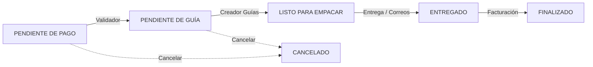

# 📦 Dashboard de Gestión de Pedidos — Ancient Nutrition

Sistema interno de gestión de pedidos para **Ancient Nutrition**, construido en PHP nativo con una arquitectura MVC ligera. Cada usuario accede a una vista personalizada según su rol, permitiendo un flujo ordenado desde la recepción del pedido hasta su cierre contable.

---

## 📋 Tabla de Contenidos

- [Características](#-características)
- [Tecnologías](#-tecnologías)
- [Arquitectura](#-arquitectura)
- [Requisitos](#-requisitos)
- [Instalación](#-instalación)
- [Configuración](#️-configuración)
- [Ejecución Local](#-ejecución-local)
- [Estructura de Archivos](#-estructura-de-archivos)
- [Roles y Permisos](#-roles-y-permisos)
- [Flujo de Estados](#-flujo-de-estados)
- [Integraciones](#-integraciones)
- [PWA](#-pwa-progressive-web-app)

---

## ✨ Características

- **Sistema de roles granular** — 8 roles con vistas y acciones específicas por usuario.
- **Gestión completa del ciclo de vida** — Desde validación de pago hasta cierre contable.
- **Carga de archivos** — Subida de guías de envío, comprobantes de entrega y facturas a Supabase Storage.
- **Webhooks en tiempo real** — Notificaciones automáticas a n8n en cada cambio de estado.
- **Filtros avanzados** — Por fecha, mes, estado y método de pago según el rol.
- **Exportación CSV** — Para el equipo de contabilidad.
- **PWA** — Instalable como aplicación nativa en dispositivos móviles.
- **Firma digital** — Captura de firma del cliente en entregas de canal.
- **Deep Linking** — Redirección post-login a la página solicitada originalmente.

---

## 🛠 Tecnologías

| Componente     | Tecnología                        |
|----------------|-----------------------------------|
| **Backend**    | PHP 8.x (nativo, sin frameworks) |
| **Base de Datos** | Supabase (PostgreSQL + REST API) |
| **Storage**    | Supabase Storage (bucket `comprobantes`) |
| **Frontend**   | HTML5, CSS3, JavaScript vanilla  |
| **Íconos**     | Font Awesome 6                   |
| **Webhooks**   | n8n (automatizaciones)           |
| **PWA**        | Service Worker + Web Manifest    |

---

## 🏗 Arquitectura

El proyecto sigue una separación MVC simplificada:

```
┌─────────────────────────────────────────────┐
│                  Browser                     │
└──────────────────┬──────────────────────────┘
                   │
┌──────────────────▼──────────────────────────┐
│           dashboard.php (Controlador)        │
│  • Autenticación (sesiones PHP)              │
│  • Filtros según rol                         │
│  • Consultas REST a Supabase                 │
│  • Instancia de Permissions                  │
└──────────────────┬──────────────────────────┘
                   │
┌──────────────────▼──────────────────────────┐
│        dashboard_view.php (Vista)            │
│  • Renderiza tabla de pedidos                │
│  • Usa $permissions para mostrar/ocultar     │
│  • Modales de detalle                        │
└─────────────────────────────────────────────┘
                   │
┌──────────────────▼──────────────────────────┐
│     includes/Permissions.php (Modelo)        │
│  • Centraliza lógica de permisos por rol     │
│  • Métodos: canValidatePayment(), etc.       │
└─────────────────────────────────────────────┘
```

---

## 📌 Requisitos

- **PHP** >= 8.1 con extensiones:
  - `curl`
  - `json`
  - `session`
  - `mbstring`
- **Navegador moderno** (Chrome, Firefox, Safari, Edge)
- **Cuenta de Supabase** con proyecto configurado

---

## 🚀 Instalación

1. **Clonar el repositorio:**

   ```bash
   git clone https://github.com/<tu-usuario>/ancient-nutrition-dashboard.git
   cd ancient-nutrition-dashboard
   ```

2. **Configurar credenciales** (ver sección [Configuración](#️-configuración))

3. **Iniciar el servidor local** (ver sección [Ejecución Local](#-ejecución-local))

> **Nota:** No se requieren dependencias externas (Composer, npm, etc.). El proyecto funciona con PHP nativo.

---

## ⚙️ Configuración

Editar el archivo `config.php` con las credenciales de tu proyecto:

### Supabase

```php
$supabaseUrl = 'https://<tu-proyecto>.supabase.co';
$supabaseKey = '<tu-anon-key>';
```

### Webhooks (n8n)

```php
define('WEBHOOK_PAGO_VALIDADO',       'https://<tu-n8n>/webhook/validar-pago');
define('WEBHOOK_PAQUETE_ENTREGADO',   'https://<tu-n8n>/webhook/paquete-entregado');
define('WEBHOOK_INGRESO_FACTURA',     'https://<tu-n8n>/webhook/ingreso-factura');
define('WEBHOOK_GUIA_CCR',            'https://<tu-n8n>/webhook/guia-ccr');
define('WEBHOOK_CANCELACION_PEDIDO',  'https://<tu-n8n>/webhook/cancelacion-pedido');
```

### Base de Datos

El sistema espera las siguientes tablas en Supabase:

| Tabla         | Descripción                                    |
|---------------|------------------------------------------------|
| `Pedidos`     | Tabla principal de pedidos con todos los campos |
| `usuarios`    | Usuarios del dashboard (login, roles)          |

#### Campos principales de `Pedidos`

| Campo                          | Tipo       | Descripción                              |
|--------------------------------|------------|------------------------------------------|
| `id`                           | `int8`     | ID único (PK)                            |
| `pedido`                       | `text`     | Número de pedido legible                 |
| `nombre`                       | `text`     | Nombre del cliente                       |
| `cedula`                       | `text`     | Cédula del cliente                       |
| `estado`                       | `text`     | Estado actual del pedido                 |
| `fecha_pedido`                 | `timestamptz` | Fecha de creación                     |
| `forma_de_pago`                | `text`     | Método de pago                           |
| `telefono`                     | `text`     | Teléfono del cliente                     |
| `correo_electronico`           | `text`     | Correo del cliente                       |
| `tipo_de_entrega`              | `text`     | Tipo de entrega (envío/retiro)           |
| `productos`                    | `text`     | Lista de productos                       |
| `total`                        | `numeric`  | Monto total en colones (₡)              |
| `direccion`                    | `text`     | Dirección de entrega                     |
| `referencia_pago`              | `text`     | Referencia del comprobante de pago       |
| `referencia_pago_por`          | `text`     | Usuario que validó el pago               |
| `referencia_pago_update`       | `timestamptz` | Fecha de validación                   |
| `qr_ccr`                       | `text`     | Ruta del archivo de guía                 |
| `guia`                         | `text`     | Número de guía de envío                  |
| `qr_ccr_por`                   | `text`     | Usuario que creó la guía                 |
| `qr_ccr_update`                | `timestamptz` | Fecha de creación de guía             |
| `entregado_cliente_comprobante`| `text`     | Ruta del comprobante de entrega          |
| `entregado_cliente_por`        | `text`     | Usuario que registró la entrega          |
| `entregado_cliente_updated`    | `timestamptz` | Fecha de entrega                      |
| `html_hoja_entrega`            | `text`     | HTML de la hoja de entrega firmada       |
| `numero_factura`               | `text`     | Número de factura electrónica            |
| `factura_url`                  | `text`     | Ruta del PDF de factura en Storage       |

#### Campos de `usuarios`

| Campo           | Tipo    | Descripción                     |
|-----------------|---------|---------------------------------|
| `id`            | `int8`  | ID único (PK)                   |
| `nombre`        | `text`  | Nombre del usuario              |
| `apellidos`     | `text`  | Apellidos del usuario           |
| `correo`        | `text`  | Correo (`usuario@enlace.org`)   |
| `password_hash` | `text`  | Hash bcrypt de la contraseña    |
| `id_rol`        | `int4`  | ID del rol (1-8)                |

---

## 🖥 Ejecución Local

```bash
# Desde el directorio del proyecto
php -S localhost:8001
```

Abrir en el navegador: [http://localhost:8001](http://localhost:8001)

> El sistema redirige automáticamente a `login.php` si no hay sesión activa.

---

## 📁 Estructura de Archivos

```
dashboard/
├── config.php                    # Credenciales Supabase, helpers cURL, webhooks
├── index.php                     # Redirect a dashboard.php
│
├── login.php                     # Autenticación de usuarios
├── logout.php                    # Cierre de sesión
├── register.php                  # Registro de usuarios (desactivado)
├── change_password.php           # Cambio de contraseña
│
├── dashboard.php                 # Controlador principal (queries + filtros)
├── dashboard_view.php            # Vista principal (tabla + modales)
│
├── includes/
│   └── Permissions.php           # Clase centralizada de permisos por rol
│
├── verificar_pago.php            # UI: Validar pago (roles 1, 2)
├── verificar_pago_entregado.php  # UI: Validar pago datáfono (rol 4)
├── process_payment.php           # API: Procesar validación de pago
├── process_payment_entregado.php # API: Procesar pago datáfono
│
├── agregar_guia.php              # UI: Agregar guía de envío (roles 1, 3)
├── upload_guia.php               # API: Subir PDF de guía a Storage
│
├── firmar_entrega.php            # UI: Firma digital de entrega (rol 4)
├── upload_signature.php          # API: Procesar firma de entrega
├── comprobante_entrega.php       # UI: Cargar comprobante de entrega (rol 8)
├── upload_comprobante.php        # API: Subir comprobante de entrega
│
├── ingresar_factura.php          # UI: Ingresar factura (roles 1, 5)
├── upload_factura.php            # API: Subir factura PDF a Storage
│
├── ajax_get_signed_url.php       # API: Obtener URL firmada de Storage
├── download_file.php             # API: Descargar archivos de Storage
│
├── css/
│   └── style.css                 # Estilos globales del dashboard
├── js/
│   └── dashboard.js              # Lógica de interacción del dashboard
├── assets/                       # Recursos estáticos adicionales
│
├── manifest.json                 # Web App Manifest (PWA)
├── sw.js                         # Service Worker (PWA)
│
├── test_connection.php           # Test de conectividad Supabase
├── test_db.php                   # Test de base de datos
├── test_roles.php                # Test de roles
├── test_session.php              # Test de sesión
│
├── Agents.md                     # Documentación interna del sistema de roles
└── README.md                     # Este archivo
```

---

## 👥 Roles y Permisos

El sistema cuenta con **8 roles** con responsabilidades diferenciadas:

| ID | Rol                    | Estado(s) que ve                                  | Acciones principales                         |
|----|------------------------|---------------------------------------------------|----------------------------------------------|
| 1  | **Administrador**      | Todos (excepto FINALIZADO por defecto)            | Acceso total, filtros avanzados              |
| 2  | **Validador de Pagos** | PENDIENTE DE PAGO, FINALIZADO                     | Validar comprobantes, ver referencia/factura  |
| 3  | **Creador de Guías**   | PENDIENTE DE GUÍA                                 | Subir guías de transporte (PDF)              |
| 4  | **Entrega de Paquetes**| LISTO PARA EMPACAR (retiro canal), ENTREGADO (datáfono) | Firmar entregas, validar pagos datáfono |
| 5  | **Ingreso de Facturas**| ENTREGADO                                         | Subir facturas del sistema contable          |
| 6  | **Contabilidad**       | FINALIZADO                                        | Exportar CSV, auditoría                      |
| 7  | **Callcenter**         | Todos excepto FINALIZADO                          | Solo lectura, seguimiento                    |
| 8  | **Correos de CR**      | LISTO PARA EMPACAR (envío correos)                | Ver pedidos listos, cargar comprobante       |

### Columnas visibles por rol

| Columna             | Admin | Validador | Guías | Entrega | Facturas | Contabilidad | Callcenter | Correos |
|---------------------|:-----:|:---------:|:-----:|:-------:|:--------:|:------------:|:----------:|:-------:|
| Pedido              |  ✅   |    ✅     |  ✅   |   ✅    |    ✅    |     ✅       |    ✅      |   ✅    |
| Nombre              |  ✅   |    ✅     |  ✅   |   ✅    |    ✅    |     ✅       |    ✅      |   ✅    |
| Cédula              |  ✅   |    ❌     |  ❌   |   ❌    |    ❌    |     ❌       |    ❌      |   ❌    |
| Estado              |  ✅   |    ✅     |  ✅   |   ✅    |    ✅    |     —        |    ✅      |   ✅    |
| Fecha               |  ✅   |    ✅     |  ✅   |   ✅    |    ✅    |     ✅       |    ✅      |   ✅    |
| Forma de Pago       |  ✅   |    ✅     |  ❌   |   ✅    |    ✅    |     ✅       |    ✅      |   ✅    |
| Teléfono            |  ✅   |    ✅     |  ✅   |   ✅    |    ✅    |     —        |    ✅      |   ✅    |
| Correo Electrónico  |  ✅   |    ❌     |  ✅   |   ✅    |    ✅    |     —        |    ✅      |   ✅    |
| Tipo de Entrega     |  ✅   |    ❌     |  ✅   |   ✅    |    ✅    |     —        |    ✅      |   ✅    |
| Productos           |  ✅   |    ❌     |  ✅   |   ✅    |    ✅    |     —        |    ✅      |   ✅    |
| Total               |  ✅   |    ✅     |  ✅   |   ✅    |    ✅    |     ✅       |    ✅      |   ✅    |
| Referencia Pago     |  ✅   |    ✅     |  ❌   |   ❌    |    ❌    |     ✅       |    ❌      |   ❌    |
| No. Factura         |  ✅   |    ✅     |  ❌   |   ❌    |    ❌    |     ✅       |    ❌      |   ❌    |
| Dirección           |  ✅   |    ❌     |  ✅   |   ❌    |    ✅    |     —        |    ✅      |   ❌    |
| Acciones            |  ✅   |    ✅     |  ✅   |   ✅    |    ✅    |     —        |    ❌      |   ✅    |

> **—** = El rol de Contabilidad (6) tiene una vista de tabla completamente diferente optimizada para auditoría.

### Ordenamiento especial

- **Validador (rol 2):** Los pedidos con estado `PENDIENTE DE PAGO` se muestran **primero**, seguidos de los demás ordenados por número de pedido descendente.

---

## 🔄 Flujo de Estados



| Transición                | Responsable         | Acción requerida                    |
|---------------------------|---------------------|-------------------------------------|
| Pendiente → Validado      | Validador (2)       | Ingresar referencia de pago         |
| Validado → Pendiente Guía | Automático (webhook) | —                                  |
| Pendiente Guía → Listo    | Creador Guías (3)   | Subir PDF de guía                   |
| Listo → Entregado         | Entrega (4) / Correos (8) | Firmar entrega / Cargar comprobante |
| Entregado → Finalizado    | Facturación (5)     | Subir factura PDF + número          |

---

## 🔗 Integraciones

### Supabase

- **REST API** — Todas las operaciones CRUD se realizan vía la API REST de Supabase usando `cURL`.
- **Storage** — Los archivos (guías, comprobantes, facturas) se almacenan en el bucket `comprobantes` con subcarpetas organizadas.
- **Signed URLs** — Para descargas seguras se generan URLs firmadas con expiración temporal.

### n8n (Webhooks)

Cada cambio de estado dispara un webhook POST a n8n con los datos del pedido:

| Evento               | Webhook                        | Datos enviados                      |
|----------------------|--------------------------------|-------------------------------------|
| Pago validado        | `/webhook/validar-pago`        | pedido, referencia, usuario         |
| Guía creada          | `/webhook/guia-ccr`            | pedido, guía, archivo, usuario      |
| Paquete entregado    | `/webhook/paquete-entregado`   | pedido, comprobante, firma          |
| Factura ingresada    | `/webhook/ingreso-factura`     | pedido, número factura, PDF         |
| Pedido cancelado     | `/webhook/cancelacion-pedido`  | pedido, motivo                      |

---

## 📱 PWA (Progressive Web App)

El dashboard es instalable como aplicación nativa gracias a:

- **`manifest.json`** — Configuración de la app (nombre, íconos, colores).
- **`sw.js`** — Service Worker para caché básico y funcionamiento offline.

### Instalar en dispositivo

1. Abrir la URL del dashboard en Chrome/Safari
2. Seleccionar **"Agregar a pantalla de inicio"**
3. La app se instalará con el ícono y nombre configurados

---

## 🔒 Seguridad

- **Autenticación por sesión PHP** — Todas las páginas verifican `$_SESSION['user_id']`.
- **Contraseñas hasheadas** — Almacenadas con `password_hash()` (bcrypt).
- **Escape de salida** — Todas las salidas usan `htmlspecialchars()` para prevenir XSS.
- **Validación de archivos** — Verificación de MIME type y tamaño máximo (10MB).
- **Logs centralizados** — Errores registrados en `app_errors.log` con timestamp y contexto.

---

## 📄 Licencia

Proyecto privado de uso interno. Todos los derechos reservados.
